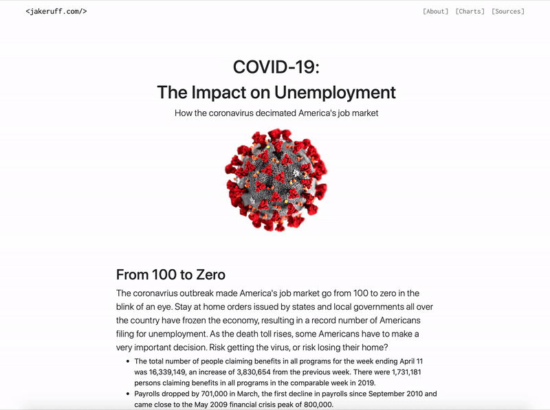

# COVID19-Unemployment
 A data-driven narrative about how COVID-19 impacted unemployment in America. Collected data from various governmental bodies and visualized them to tell a story about job loss during the pandemic. The website was my final project for my coding & data skills class.

## Built With
* HTML
* CSS
* Bootstrap
* JavaScript
* Google Charts
* Highcharts

## Live Demo
* [Visit the site on my portfolio here](http://finaldata.jakeruff.com/)